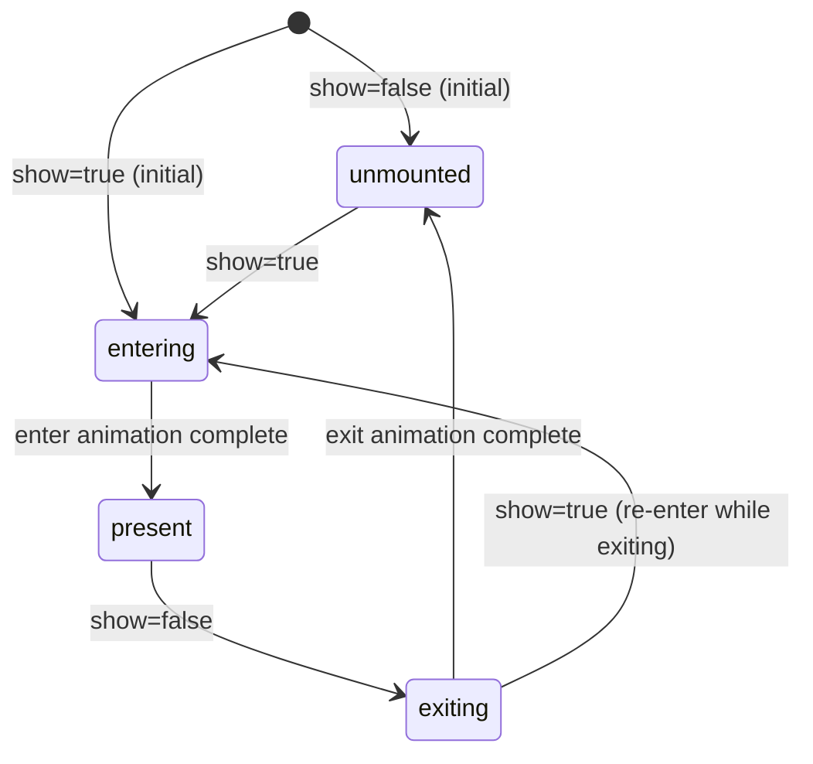

# Architecture — @kamod-ch/motion

This document defines binding rules for the `kamod-ch/kamod-motion` monorepo.

**Audited dependency:** `motion@13.1.1` (lockfile + installed types in `node_modules/motion/dist/*.d.ts`, backed by `framer-motion@13.1.1` → `motion-dom@13.1.1`).

## Goals

- Ship a **Preact-first**, **ESM-only** animation library as `@kamod-ch/motion`.
- Wrap **Vanilla Motion** (`motion` package) without React bindings.
- Default to the **`motion/mini`** engine for minimal bundle cost.
- Expose the **hybrid/full Motion engine** only via `@kamod-ch/motion/hybrid` and hybrid subpaths.

## Non-goals (v0.1)

- No `motion/react`, `react`, or `react-dom` dependencies or re-exports.
- No coupling to `@kamod-ch/ui`, `@kamod-ch/charts`, or `@kamod-ch/themes` in the core package.
- No layout projection, drag/gesture wrappers, or scroll-linked animation in v0.1.

## Workspace layout

```
packages/
  core/     → @kamod-ch/motion (published)
  docs/     → private PreactPress site (@kamod-ch/motion-docs)
examples/
  preact-vite/ → tarball QA consumer reference
```

---

## Verified Motion support matrix (`motion@13.1.1`)

Sources: installed `.d.ts` files (`motion/dist/mini.d.ts`, `motion/dist/index.d.ts` → `framer-motion/dist/dom*.d.ts`, `motion-dom/dist/index.d.ts`) and runtime smoke tests in `packages/core/tests/contracts/`.

### Entry-point exports

| Entry         | Runtime exports (verified)                                                                                                                                                                         | Type re-exports                                                                                                   |
| ------------- | -------------------------------------------------------------------------------------------------------------------------------------------------------------------------------------------------- | ----------------------------------------------------------------------------------------------------------------- |
| `motion/mini` | `animate` (alias of `animateMini`), `animateSequence`                                                                                                                                              | Sequence/timeline types from `motion-dom`                                                                         |
| `motion`      | Full `animate` overloads, `animateMini`, `scroll`, `scrollInfo`, `inView`, `createScopedAnimate`, `distance`, `distance2D`, plus **all** `motion-dom` + `motion-utils` exports (~312 runtime keys) | `DOMKeyframesDefinition`, `AnimationOptions`, `Transition`, `MotionValue`, `AnimationPlaybackControlsWithThen`, … |

`motion/react`, `motion/react-*` exist in the package but are **forbidden** in this repository.

### `animate` controls (`AnimationPlaybackControlsWithThen`)

Returned by both engines (typed in `motion-dom/dist/index.d.ts`):

| Member                                                                 | Behavior (from types + mini runtime smoke)                                |
| ---------------------------------------------------------------------- | ------------------------------------------------------------------------- |
| `play()` / `pause()`                                                   | Playback control                                                          |
| `stop()`                                                               | Stops at current state; prevents resume on next play (`motion-dom` JSDoc) |
| `cancel()`                                                             | Cancels and applies **initial** state (`motion-dom` JSDoc)                |
| `complete()`                                                           | Jumps to **final** state                                                  |
| `finished`                                                             | `Promise<any>`                                                            |
| `then(onResolve)`                                                      | Promise-like chaining (`GroupAnimationWithThen`)                          |
| `time`, `speed`, `duration`, `iterationDuration`, `startTime`, `state` | Playback metadata                                                         |

**Mini null-element edge case (verified):** `animate(null, keyframes)` returns a `GroupAnimationWithThen` with `animations: []`; `stop`/`cancel`/`complete`/`finished`/`then` are still callable.

**Invalid elements:** `animate(undefined | missing selector)` throws `No valid elements provided` (motion-utils invariant in `animate-elements.mjs`).

### Target types (what keyframes can animate)

`DOMKeyframesDefinition` (`motion-dom`) is the union of:

| Category         | Keys (verified)                                                                                                                       | Mini (`motion/mini`)        | Hybrid (`motion`)          |
| ---------------- | ------------------------------------------------------------------------------------------------------------------------------------- | --------------------------- | -------------------------- |
| HTML/CSS styles  | `CSSStyleDeclarationWithTransform` keys incl. `opacity`, `transform`, `x`/`y`/`z`, `translateX/Y/Z`, `rotate*`, `scale*`, `filter`, … | WAAPI via `NativeAnimation` | WAAPI + JS fallback        |
| CSS variables    | `` `--${string}` ``                                                                                                                   | WAAPI when supported        | WAAPI + JS fallback        |
| SVG attributes   | `SVGAttributes` (incl. `fill`, `stroke`, `opacity`, `r`, `cx`, `cy`, …)                                                               | WAAPI per property          | WAAPI + JS fallback        |
| SVG path metrics | `pathLength`, `pathOffset`, `pathSpacing` (`SVGPathProperties`)                                                                       | WAAPI on SVG elements       | WAAPI + JS fallback        |
| SVG forced attrs | `attrX`, `attrY`, `attrScale`                                                                                                         | WAAPI                       | WAAPI + JS fallback        |
| Plain objects    | `animate(object, keyframes)`                                                                                                          | **Not exported**            | JS engine                  |
| `MotionValue`    | `animate(motionValue, keyframes)`                                                                                                     | **Not exported**            | JS engine (`animateValue`) |

**WAAPI-accelerated properties** (from `accelerated-values.mjs`): `opacity`, `clipPath`, `filter`, `transform`, `backgroundColor` (+ browser-only color formats via `supportsBrowserAnimation`).

### Sequences, spring, stagger

| Feature                                       | Mini                                                                                                                 | Hybrid                                                             | Evidence                                                                                                      |
| --------------------------------------------- | -------------------------------------------------------------------------------------------------------------------- | ------------------------------------------------------------------ | ------------------------------------------------------------------------------------------------------------- |
| DOM sequence timelines                        | `animateSequence(segments, options?)` — DOM segments only                                                            | `animate(segments, options?)` or `animateSequence` with generators | `dom-mini.d.ts` exports; `waapi/animate-sequence.mjs` uses `createAnimationsFromSequence` → `animateElements` |
| Function segments `[fn, …]`                   | **No** — not pre-processed                                                                                           | **Yes** — converted to `MotionValue` segments                      | `animation/animate/sequence.mjs` (hybrid only)                                                                |
| `MotionValue` segments                        | Parsed in timeline builder but **not animated** by mini path                                                         | Animated via `animateSubject`                                      | Mini `forEach` calls `animateElements(element, …)` only                                                       |
| `stagger()` helper                            | **Not exported**; stagger **delay functions** work inside `animate`/`animateSequence` options                        | Exported; usable in `delay` / `delayChildren`                      | `animate-elements.mjs` resolves `delay(i, n)`                                                                 |
| `type: "spring"`                              | Converted to duration/easing when `supportsLinearEasing()`; otherwise falls back to `duration: 300, ease: "easeOut"` | Full spring via `generators: { spring }` + `JSAnimation`           | `apply-generator.mjs`, `animation/animate/sequence.mjs`                                                       |
| `type: "inertia"`                             | Excluded from WAAPI (`supportsBrowserAnimation` checks `type !== "inertia"`)                                         | JS engine                                                          | `waapi/supports/waapi.mjs`                                                                                    |
| Segment lifecycle callbacks (`onComplete`, …) | **Sequence-level only** (`SequenceOptions.onComplete`); per-segment callbacks stripped                               | Same rule                                                          | Comment in `dom.d.ts` / `dom-mini.d.ts`                                                                       |

### Hybrid-only APIs (require `@kamod-ch/motion/hybrid`)

| API                                                 | Purpose                               |
| --------------------------------------------------- | ------------------------------------- |
| `motionValue`, `animateValue`, `animateMotionValue` | Reactive JS-driven values             |
| `stagger()`                                         | Stagger delay factory for transitions |
| `scroll`, `scrollInfo`, `inView`                    | Scroll/viewport linked animation      |
| `createScopedAnimate()`                             | Scope-bound full `animate`            |
| `hover`, `press`, `drag` (via `motion-dom`)         | Gesture-driven effects                |
| Layout / projection / `LayoutAnimationBuilder`      | FLIP-style layout (not v0.1)          |
| `transition.path` / `MotionPath`                    | Curved motion paths                   |
| Object target animations                            | Non-DOM imperative targets            |

### SSR / Node behavior (verified)

| Scenario                                        | Result                                                                                   |
| ----------------------------------------------- | ---------------------------------------------------------------------------------------- |
| Static `import 'motion/mini'` in Node 22        | **OK** — no throw                                                                        |
| Static `import 'motion'` in Node 22             | **OK** — no throw                                                                        |
| `animate(null, …)` in Node                      | Returns empty control handle (no throw)                                                  |
| `animate(missingElement, …)` in Node            | **Throws** `No valid elements provided`                                                  |
| `prefersReducedMotion` global (`motion-dom`)    | `{ current: boolean \| null }` — initialized in browser via `initPrefersReducedMotion()` |
| Render-to-string of `@kamod-ch/motion` wrappers | Must **not** call `animate` during SSR; hooks return safe defaults (see SSR contract)    |

### Tree-shaking

| Import pattern                                           | Approx. minified gzip (esbuild bundle, browser, no externals) |
| -------------------------------------------------------- | ------------------------------------------------------------- |
| `import { animate } from 'motion/mini'`                  | **~3.1 KB**                                                   |
| `import { animate, motionValue, stagger } from 'motion'` | **~22.8 KB**                                                  |

`motion` and `motion/mini` are marked `sideEffects: false`. Root `@kamod-ch/motion` modules must **never** import `motion` (full) or `./hybrid` — only `motion/mini` — so consumer bundles that import mini subpaths do not pull the hybrid engine.

---

## Version 0.1 export map (contract)

Implementation follows in a later phase. Types reference `motion-dom` shapes via `motion` / `motion/mini` peer.

### `@kamod-ch/motion` (mini engine default)

| Export path                  | Symbol(s)                                                     | Engine                    |
| ---------------------------- | ------------------------------------------------------------- | ------------------------- |
| `.`                          | Re-exports below (no hybrid symbols)                          | Mini                      |
| `./mini`                     | `animate`, `animateSequence` + type re-exports                | Mini                      |
| `./hooks/use-reduced-motion` | `useReducedMotion`                                            | Mini (no `motion` import) |
| `./hooks/use-animate`        | `useAnimate`                                                  | Mini                      |
| `./motion`                   | `Motion`                                                      | Mini                      |
| `./presence`                 | `Presence`, `usePresence`                                     | Mini                      |
| `./presets`                  | `fade`, `fadeIn`, `fadeOut`, `slide*`, `zoom*`, `Preset` type | Mini (static data)        |
| `./value`                    | `animateNumber`, `useAnimateNumber`                           | Mini (rAF driver)         |
| `./svg`                      | `animateSvg`, `useAnimateSvg`, SVG keyframe types             | Mini                      |

### `@kamod-ch/motion/hybrid` (opt-in)

| Export path | Symbol(s)                                                                          | Engine |
| ----------- | ---------------------------------------------------------------------------------- | ------ |
| `.`         | `motionValue`, `animateValue`, `followValue`, `stagger`, `spring`, type re-exports | Hybrid |
| `./value`   | `animateHybridValue`, `useMotionValue`, `useSpring`, `createMotionValue`           | Hybrid |

**Deferred beyond v0.1:** `./hybrid/scroll`, layout, gestures, path factories (`arc`), `ViewTransitionBuilder`.

---

## Mini / hybrid decision per v0.1 export

| Export                                                             | Engine            | Rationale                                                                         |
| ------------------------------------------------------------------ | ----------------- | --------------------------------------------------------------------------------- |
| `useReducedMotion`                                                 | Mini              | Uses `matchMedia`; aligns with `@kamod-ch/charts` today; no Motion runtime needed |
| `useAnimate`, `Motion`, `Presence`, `presets`, `svg`, `animateSvg` | Mini              | DOM/CSS/SVG WAAPI covers Kamod UI overlays + chart path reveals                   |
| `animateNumber`, `useAnimateNumber`                                | Mini              | rAF numeric driver for tick labels and counters without pulling hybrid            |
| `useMotionValue`, `useSpring`, `animateHybridValue`, `stagger`     | Hybrid            | Requires `MotionValue` / JS animation pipeline                                    |
| Chart numeric tick/count-up (high-fidelity spring)                 | Hybrid (optional) | Prefer `./hybrid/value` when Motion spring generators are required                |
| Dialog enter/exit (opacity, transform, scale)                      | Mini              | Matches current Tailwind `animate-in` / `fade-in` / `zoom-in-95` patterns         |

---

## v0.1 API signatures

Types shown as `@kamod-ch/motion` contracts; underlying animation types come from `motion-dom` via peer `motion@^13.1.1`.

### Shared types

```typescript
/** Matches motion-dom ReducedMotionConfig */
type ReducedMotionPolicy = "user" | "always" | "never";

/** Re-export from motion-dom via peer */
type KamodAnimationControls = AnimationPlaybackControlsWithThen;
type KamodKeyframes = DOMKeyframesDefinition;
type KamodTransition = AnimationOptions; // DOM element animations
```

### `useReducedMotion`

```typescript
interface UseReducedMotionOptions {
  /** @default "user" */
  policy?: ReducedMotionPolicy;
}

/** Returns whether animations should be suppressed. */
function useReducedMotion(options?: UseReducedMotionOptions): boolean;
```

| Policy     | Return value                                                                                   |
| ---------- | ---------------------------------------------------------------------------------------------- |
| `"user"`   | `matchMedia("(prefers-reduced-motion: reduce)").matches` (false when `matchMedia` unavailable) |
| `"always"` | `true`                                                                                         |
| `"never"`  | `false`                                                                                        |

### `useAnimate`

```typescript
interface UseAnimateResult<T extends Element = HTMLElement> {
  ref: RefObject<T>;
  /** Scoped mini-engine animate bound to `ref.current` (falls back to no-op controls when null). */
  animate: (keyframes: KamodKeyframes, options?: KamodTransition) => KamodAnimationControls;
}

function useAnimate<T extends Element = HTMLElement>(): UseAnimateResult<T>;
```

Implementation note: internally wraps `motion/mini` `animate` with an element scope equivalent to `createScopedWaapiAnimate(scope)` behavior.

### `Motion`

```typescript
interface MotionProps<T extends keyof HTMLElements = "div"> {
  as?: T;
  initial?: KamodKeyframes | false;
  animate?: KamodKeyframes | false;
  exit?: KamodKeyframes | false;
  transition?: KamodTransition;
  reducedMotion?: ReducedMotionPolicy;
  children?: ComponentChildren;
  /** Remaining DOM props forwarded to the host element */
  [prop: string]: unknown;
}

function Motion<T extends keyof HTMLElements = "div">(props: MotionProps<T>): JSX.Element;
```

Does **not** accept React-only props (`layout`, `drag`, `whileHover`, …) in v0.1.

### `Presence` / `usePresence`

```typescript
type PresencePhase = "unmounted" | "entering" | "present" | "exiting";

interface PresenceProps {
  /** When false, exit phase begins (if mounted). */
  show: boolean;
  /** When false, skip enter animation on first mount. @default true */
  initial?: boolean;
  reducedMotion?: ReducedMotionPolicy;
  /** Called after exit animation completes and the subtree is unmounted. */
  onExitComplete?: () => void;
  /** Stable identity for nested presence registration. */
  id?: string | number;
  children: ComponentChildren | ((phase: PresencePhase) => ComponentChildren);
}

function Presence(props: PresenceProps): JSX.Element | null;

interface PresenceContextValue {
  phase: PresencePhase;
  /** Call when this node's exit animation has finished (multi-node exits). */
  safeToRemove: () => void;
}

function usePresence(): PresenceContextValue;
```

#### Presence state machine



| Transition                                                | Behavior                                                                                                 |
| --------------------------------------------------------- | -------------------------------------------------------------------------------------------------------- |
| `present → exiting`                                       | Run `exit` keyframes (or preset); keep DOM mounted                                                       |
| `exiting → unmounted`                                     | Call `onExitComplete`; remove children                                                                   |
| `exiting → entering` (**show true while exit in flight**) | **Cancel** exit controls (`controls.stop()`), skip `onExitComplete`, run enter from current visual state |
| `entering → present`                                      | Fire after enter controls `finished` resolves                                                            |
| Reduced motion active                                     | Skip animations; jump to target state; `entering`/`exiting` phases resolve in the same frame             |

Reference: mirrors `AnimatePresence` `mode: "sync"` interrupt semantics from `framer-motion` (child stays mounted until exit completes unless re-shown).

### `presets`

```typescript
interface Preset {
  initial?: KamodKeyframes;
  animate: KamodKeyframes;
  exit?: KamodKeyframes;
  transition?: KamodTransition;
}

declare const fade: Preset;
declare const fadeIn: Preset;
declare const fadeOut: Preset;
declare const slideInFromTop: Preset;
declare const slideInFromBottom: Preset;
declare const slideInFromLeft: Preset;
declare const slideInFromRight: Preset;
declare const zoomIn95: Preset;
declare const zoomOut95: Preset;
```

Presets map 1:1 to Kamod UI Tailwind animation utility names (`fade-in`, `zoom-in-95`, …) but emit Motion keyframes instead of CSS `@keyframes`.

### `@kamod-ch/motion/value` (mini numeric driver)

```typescript
interface AnimateNumberOptions {
  from?: number;
  to: number;
  duration?: number;
  type?: "tween" | "spring";
  ease?: (t: number) => number | Array<(t: number) => number>;
  spring?: { stiffness?: number; damping?: number; mass?: number };
  delay?: number;
  onUpdate: (value: number) => void;
  onComplete?: () => void;
  reducedMotion?: boolean;
}

function animateNumber(options: AnimateNumberOptions): KamodAnimationControls;

function useAnimateNumber(target: number, options?: UseAnimateNumberOptions): number;
```

Uses a lightweight **rAF driver** (no `motion` import). Reduced motion jumps to `to` synchronously.

### `svg` / `animateSvg`

```typescript
type SvgKeyframes = Pick<
  KamodKeyframes,
  | "pathLength"
  | "pathOffset"
  | "pathSpacing"
  | "attrX"
  | "attrY"
  | "attrScale"
  | "opacity"
  | "fill"
  | "stroke"
  | "strokeWidth"
  | "r"
  | "cx"
  | "cy"
  | "x"
  | "y"
  | "rotate"
  | "scale"
>;

function animateSvg(
  target:
    | SVGElement
    | SVGElement[]
    | NodeListOf<SVGElement>
    | string
    | { current: SVGElement | null },
  keyframes: SvgKeyframes,
  options?: KamodTransition & { reducedMotion?: boolean },
): KamodAnimationControls;

function useAnimateSvg<T extends SVGElement = SVGElement>(): UseAnimateSvgResult<T>;
```

**Charts v0.1 scope:** line/area path reveal via `pathLength` + `pathOffset`; bar grow via `scaleY`/`transform`; point enter via `opacity` + `r`. **Not in v0.1:** morphing `d` path strings (requires hybrid JS engine + flubber/manual interpolation).

### Hybrid `./hybrid` and `./hybrid/value`

```typescript
function createMotionValue<T extends string | number>(initial: T): MotionValue<T>;

function useMotionValue<T extends string | number>(initial: T): MotionValue<T>;

function useSpring(source: MotionValue<number>, config?: SpringOptions): MotionValue<number>;

function animateHybridValue<T extends number | string = number>(
  options: HybridAnimateValueOptions<T>,
): KamodAnimationControls;
```

**Deferred:** `Value` render component (text node formatter) — charts can call `onUpdate` imperatively.

---

## `@kamod-ch/charts` requirements (audit only)

Verified from `kamod-charts` RFC/docs (no code copied, no dependency added):

| Charts need                                   | `@kamod-ch/motion` answer                                  | Status       |
| --------------------------------------------- | ---------------------------------------------------------- | ------------ |
| Reduced-motion detection (`useReducedMotion`) | `./hooks/use-reduced-motion`                               | Implemented  |
| Path reveal (`pathLength`)                    | `./svg` `animateSvg`                                       | Implemented  |
| Point/bar opacity + radius                    | `./svg` (`opacity`, `r`, `scale`)                          | Implemented  |
| Numeric tick / label interpolation            | `./value` `animateNumber` or d3-interpolate in charts      | Implemented  |
| Transition gating (`shouldAnimate`)           | Charts-local helper; motion provides `reducedMotion` flags | Charts-owned |
| Axis/series/chart component animations        | Not in motion — charts compose primitives                  | **Deferred** |
| LineChart/BarChart animation orchestration    | Not in motion — charts package                             | **Deferred** |
| Data-driven `d` path morphing                 | Hybrid JS + external interpolator                          | **Deferred** |
| Scroll-linked chart animations                | `./hybrid` `scroll`/`inView` (deferred export)             | **Deferred** |
| Staggered multi-series enter                  | `./hybrid` `stagger` + chart-local delays                  | Partial      |

---

## Deferred chart APIs (explicit non-goals)

- `LineChart`, `BarChart`, axis, legend, tooltip, or series animation wrappers.
- Automatic domain/scale tweening (charts keep d3-scale + optional `animateNumber` on output).
- SVG `d` string morphing and layout-projection for chart reflow.
- Imperative DOM measurement helpers (`getBoundingClientRect` wrappers) — charts own layout.

### Hybrid `Value` (legacy contract snippet)

---

## SSR / hydration contract

1. **Module scope:** No `window`, `document`, `matchMedia`, or `animate()` at top level in any `@kamod-ch/motion` entry.
2. **`useReducedMotion`:** Returns `false` on server; subscribes in `useEffect` on client.
3. **`Motion` / `Presence`:** Server render = static HTML using `initial` keyframes (or `animate` if `initial: false`); **no** `animate()` calls until `useLayoutEffect` on client.
4. **Hydration mismatch:** First client frame applies inline styles from resolved keyframes before paint (use `useLayoutEffect`, not `useEffect`, for enter animations).
5. **`useAnimate`:** Returns no-op controls during SSR (`animations: []` pattern, same as `motion/mini` null target).
6. **Peer `motion` import in SSR bundles:** Allowed for type-only imports; runtime imports of `motion/mini` are safe in Node (verified).

---

## Reduced-motion policy

| Layer                                    | Behavior                                                                       |
| ---------------------------------------- | ------------------------------------------------------------------------------ |
| `useReducedMotion({ policy: "user" })`   | Reflects OS setting                                                            |
| `useReducedMotion({ policy: "always" })` | Forces reduced                                                                 |
| Component `reducedMotion` prop           | Overrides hook for that subtree                                                |
| `AnimationOptions.reduceMotion: true`    | Passed through to `motion/mini` (maps to `ReduceMotionOption` in `motion-dom`) |
| `AnimationOptions.skipAnimations: true`  | Jump to end state (Motion native; use for tests)                               |

When reduced motion is active, `@kamod-ch/motion` **must not** rely on WAAPI running — apply target styles synchronously and resolve `finished` immediately.

---

## Error and cleanup behavior

| Situation                          | v0.1 behavior                                                                          |
| ---------------------------------- | -------------------------------------------------------------------------------------- |
| Animate with missing element       | Propagate Motion error in dev; `useAnimate` returns empty controls when ref unset      |
| Component unmount during animation | Call `controls.stop()` on all active controls in `useLayoutEffect` cleanup             |
| `Presence` unmount                 | Stop exit/enter controls; call `onExitComplete` only if exit phase completed           |
| `show` flip during exit            | Stop exit controls; restart enter (see state machine)                                  |
| `animateSequence` failure          | Reject `finished`; no partial state rollback beyond Motion native `cancel()` semantics |
| Invalid keyframes                  | Let Motion throw; do not swallow in library code                                       |

---

## Bundle budgets and measurement

### Peer dependency baseline (not counted against `@kamod-ch/motion`)

Measured 2026-08-30 with `esbuild --bundle --minify --platform=browser` + `gzip -c`:

| Import                                         | gzip size |
| ---------------------------------------------- | --------- |
| `motion/mini` (`animate` only)                 | ~3.1 KB   |
| `motion` (`animate`, `motionValue`, `stagger`) | ~22.8 KB  |

### `@kamod-ch/motion` wrapper budgets (esbuild gzip, peers external)

| Entry                              | v0.1 budget | Measurement command (CI, future) |
| ---------------------------------- | ----------- | -------------------------------- |
| `@kamod-ch/motion` (mini subgraph) | ≤ **8 KB**  | `pnpm size` (root entry)         |
| `@kamod-ch/motion/value`           | ≤ **3 KB**  | `pnpm size` (value entry)        |
| `@kamod-ch/motion/svg`             | ≤ **4 KB**  | `pnpm size` (svg entry)          |
| `@kamod-ch/motion/hybrid`          | ≤ **20 KB** | `pnpm size` (hybrid entry)       |

Measurement excludes `preact`, `motion`, and `motion/mini` (peer dependencies). CI step runs after implementation lands.

---

## Risks and deferred features

| Item                                            | Risk / reason                                                | Target                                                        |
| ----------------------------------------------- | ------------------------------------------------------------ | ------------------------------------------------------------- |
| WAAPI spring fidelity                           | Mini converts springs to eased tweens                        | Document in presets; offer hybrid `useSpring` for critical UI |
| SVG `d` path morph                              | Not in `DOMKeyframesDefinition` as reliably WAAPI-animatable | v0.2+ hybrid                                                  |
| `scroll` / `inView`                             | Hybrid-only, not needed for UI overlays v0.1                 | v0.2                                                          |
| Layout animations                               | Projection engine size + complexity                          | Out of scope                                                  |
| `@kamod-ch/charts` duplicate `useReducedMotion` | Divergent behavior                                           | Charts re-exports from `@kamod-ch/motion` in v0.2             |
| Function timeline segments                      | Hybrid-only                                                  | Document; use hybrid when needed                              |
| Color OKLCH in older browsers                   | WAAPI forced for browser-only colors                         | Test in docs phase                                            |

---

## Deviations from scaffold (Teil A)

| Scaffold plan                                      | v0.1 audit decision                                                                                                                                   |
| -------------------------------------------------- | ----------------------------------------------------------------------------------------------------------------------------------------------------- |
| Only `.` and `./hybrid` exports                    | **Expanded** subpath map (`./motion`, `./presence`, `./presets`, `./svg`, `./hooks/*`, `./mini`, `./hybrid/value`) for tree-shaking + Kamod UI parity |
| Placeholder `MOTION_ENGINE` constants              | **Unchanged** until implementation phase — constants are not part of v0.1 public API                                                                  |
| Future `@kamod-ch/motion/fade` per-component paths | **Replaced** by `./presets` module + `Motion`/`Presence` props                                                                                        |
| Bundle budgets without method                      | **Added** esbuild gzip methodology + peer baseline sizes                                                                                              |
| Generic SSR rules                                  | **Replaced** with concrete hook/component SSR contract                                                                                                |

---

## Dependency rules

### Runtime (`packages/core`)

| Allowed                                                | Forbidden                                              |
| ------------------------------------------------------ | ------------------------------------------------------ |
| Peer: `preact`, `motion`                               | `@kamod-ch/ui`, `@kamod-ch/charts`, `@kamod-ch/themes` |
| `motion/mini` (default subgraph)                       | `motion/react`, `motion/react-*`                       |
| `motion` (hybrid subgraph only)                        | `react`, `react-dom`                                   |
| Preact: `preact`, `preact/hooks`, `preact/jsx-runtime` |                                                        |

All Motion and Preact imports stay **external** in tsup.

### Root workspace

Tooling only: `typescript`, `oxlint`, `oxfmt`, `@types/node`.

---

## Build pipeline

1. **tsup** — ESM + `.d.ts`, externals for Preact and Motion.
2. **tsc --noEmit** — strict typecheck (`src/`, `tests/contracts/`).
3. **vitest** — unit tests + `tests/contracts/` smoke/type tests.
4. **publint** / **attw** (`esm-only`) — publish shape.

## Tooling conventions

- **pnpm** 11.x · **Node** ≥ 20 (CI: 22) · **TypeScript** 6.x · **Oxlint** + **Oxfmt**

## CI quality gate

`pnpm install` → `typecheck` → `lint` → `format:check` → `test` → `build` → docs build → docs E2E → `qa:publint` → `qa:attw` → `git diff --check`

Release QA (manual): `pnpm qa:release` — publint, attw, bundle sizes, import graph, tarball consumer smoke.
